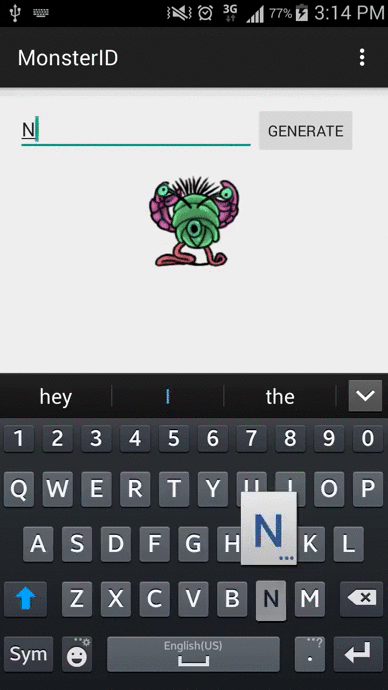

MonsterID-android
=================

MonsterID is a method of generating a unique monster image based upon a certain identifier, usually based on IP address, email address or something similar. It’s used to automatically create a personal avatar image in blog comments  and community sites.

I decided to make my own implementation for android. 

You can learn more about it at: http://www.splitbrain.org/projects/monsterid

###### How it works:

1. Convert your email/name/ip in md5
2. Use first 12 bytes to generate random numbers
3. Get parts of monsters with random numbers
4. Put parts of monster together and colorize them

Usage
----

TODO
----
1. Use cache to store images

License
----

#### Monster "parts" lincense

for this application we use the artwork of  Scott Sherrill, which is distributed under a [Creative Commons Attribution 2.5 License](https://creativecommons.org/licenses/by/2.5/).

For more information see his web site: http://scott.sherrillmix.com/blog/blogger/wp_monsterid/

#### This application license
###### The MIT License (MIT)

Copyright (c) 2015 Alexandre Pinheiro

Permission is hereby granted, free of charge, to any person obtaining a copy
of this software and associated documentation files (the "Software"), to deal
in the Software without restriction, including without limitation the rights
to use, copy, modify, merge, publish, distribute, sublicense, and/or sell
copies of the Software, and to permit persons to whom the Software is
furnished to do so, subject to the following conditions:

The above copyright notice and this permission notice shall be included in
all copies or substantial portions of the Software.

THE SOFTWARE IS PROVIDED "AS IS", WITHOUT WARRANTY OF ANY KIND, EXPRESS OR
IMPLIED, INCLUDING BUT NOT LIMITED TO THE WARRANTIES OF MERCHANTABILITY,
FITNESS FOR A PARTICULAR PURPOSE AND NONINFRINGEMENT. IN NO EVENT SHALL THE
AUTHORS OR COPYRIGHT HOLDERS BE LIABLE FOR ANY CLAIM, DAMAGES OR OTHER
LIABILITY, WHETHER IN AN ACTION OF CONTRACT, TORT OR OTHERWISE, ARISING FROM,
OUT OF OR IN CONNECTION WITH THE SOFTWARE OR THE USE OR OTHER DEALINGS IN
THE SOFTWARE.

